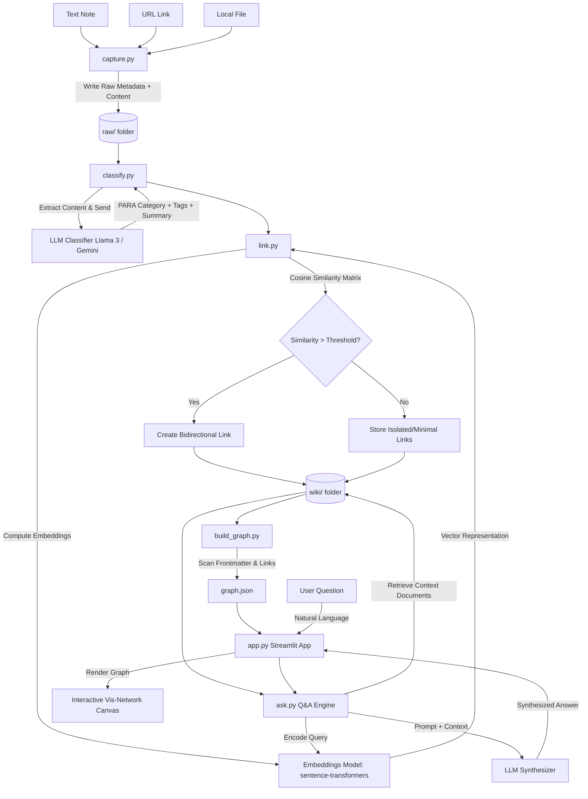

# Architecture: SecondSelf — Your Personal AI Second Brain

This document defines the system architecture, component design, data flow, schemas, and technology stack for **SecondSelf**, a self-organizing digital second brain.

---

## 1. System Overview

SecondSelf is structured as a processing pipeline that transitions unstructured raw captures into a structured, auto-linked knowledge graph (the **Librarian** & **Cartographer** phases) and exposes it via an interactive visualization and natural-language Q&A interface (the **Oracle** phase).



---

## 2. Directory Structure

The project conforms to the following directory layout:

```text
secondself/
├── docs/                      # Project documentation (Problem Statement, Architecture, etc.)
│   ├── problemstatement.md
│   └── architecture.md
├── raw/                       # Week 1: Raw captured data (.json metadata + files)
├── wiki/                      # Week 2: Organized knowledge base using PARA Method
│   ├── Projects/              # Time-bound active goals
│   ├── Areas/                 # Ongoing responsibilities/standards
│   ├── Resources/             # Topics of interest / reference material
│   └── Archives/              # Inactive items from the other three categories
├── templates/                 # UI assets, HTML/JS templates for the graph visualizer
│   └── graph_viewer.html      # vis.js visualization canvas template
├── capture.py                 # Week 1: Ingestion engine (CLI tool)
├── classify.py                # Week 2: LLM classifier for PARA tagging & summaries
├── link.py                    # Week 2: Vector embedding generator & similarity connector
├── build_graph.py             # Week 3: Exposes notes database as nodes and edges
├── graph.json                 # Week 3: Output graph representation for the UI
├── ask.py                     # Week 4: RAG Q&A retrieval and synthesis engine
├── app.py                     # Week 4: Streamlit web interface (Graph + Q&A Search)
├── requirements.txt           # Python dependencies
└── README.md                  # Project setup, execution instructions, and walkthrough
```

---

## 3. Component Details & Data Flow

### 3.1. Ingestion Engine (`capture.py`)
- **Responsibility**: Accept notes (text), links (URLs), or files (PDFs, text files, images) from the command line, package them uniformly, and save them to `raw/`.
- **Workflow**:
  1. Generate a UUID (unique ID) and timestamp.
  2. For a **note**: Capture input text directly.
  3. For a **link**: Fetch HTML, strip markup to extract markdown/text content, and record the original URL.
  4. For a **file**: Copy the file to `raw/` and extract its raw text (e.g., via simple text readers or `PyPDF2` / `pypdf` for PDFs).
  5. Write a JSON metadata file: `raw/{id}.json` housing details (id, timestamp, type, source, content, raw_file_path).

### 3.2. Classification Engine (`classify.py`)
- **Responsibility**: Transform raw data from `raw/` into structured documents categorized according to the **PARA method**.
- **Workflow**:
  1. Read unprocessed items from `raw/`.
  2. Construct a prompt containing the note content and instructions for Llama 3 (via Groq) / Gemini to output a structured JSON response specifying:
     - `category`: Projects, Areas, Resources, or Archives.
     - `tags`: List of relevant strings.
     - `summary`: One-line summary of the content.
     - `title`: A concise, human-readable title.
  3. Relocate or generate the note in the structured directory: `wiki/{category}/{title_slug}.md`.
  4. The output format is a **Markdown file with YAML Frontmatter**.

### 3.3. Similarity & Association Engine (`link.py`)
- **Responsibility**: Detect logical connections between notes using dense vector embeddings and write bidirectional links.
- **Workflow**:
  1. For each note in `wiki/`, generate text embeddings using a local Hugging Face model (e.g., `all-MiniLM-L6-v2` via `sentence-transformers`).
  2. Store embeddings in a local caching format (e.g., a simple pickle file or JSON map `embeddings.json` mapping `note_id` or filepath to vector).
  3. When a new note is processed:
     - Compute its embedding vector.
     - Calculate cosine similarity against all existing notes' vectors.
     - If similarity exceeds a defined threshold (e.g., $0.45$), record the relationship.
  4. Append a Markdown link section at the bottom of the connected notes referencing the related files (e.g., `[[Related Note Title]]` or `[Related Note Title](../Category/related_note.md)`).

### 3.4. Graph Representation Engine (`build_graph.py`)
- **Responsibility**: Traverse `wiki/` folders, parse notes and their links, and construct a graph network.
- **Workflow**:
  1. Walk recursively through `wiki/`.
  2. Parse frontmatter of each `.md` file to fetch metadata (ID, title, category, tags, summary).
  3. Parse the body of each `.md` file to find links (Wikilinks or relative Markdown links).
  4. Construct the graph representation:
     - **Node**: `{ id, label, title (for tooltip), group (PARA category), val (size proportional to incoming links) }`
     - **Edge**: `{ from, to, value (strength of relationship or default weight) }`
  5. Export to `graph.json`.

### 3.5. Q&A Retrieval Engine (`ask.py`)
- **Responsibility**: Execute Retrieval-Augmented Generation (RAG) queries over the personal knowledge base.
- **Workflow**:
  1. Receive natural language user query.
  2. Encode query using the same `sentence-transformers` model.
  3. Rank notes by cosine similarity and select the top $K$ (typically 3-5) most relevant notes.
  4. Read the text content of these top notes.
  5. Format a prompt for the LLM:
     ```text
     Context notes:
     ---
     Note: [Title]
     Summary: [Summary]
     Content: [Content]
     ---
     Question: [User Query]

     Synthesize a concise, accurate answer strictly utilizing the provided context. If the answer cannot be determined, state so.
     ```
  6. Return the synthesized text answer along with source attribution links.

### 3.6. User Interface (`app.py`)
- **Responsibility**: A premium, unified portal containing:
  1. **Q&A System**: Search query input, thinking state animations, and a rich markdown-rendered answer interface detailing source citations.
  2. **Interactive Graph**: A force-directed layout canvas rendering nodes (colored by PARA category) and links, featuring hover states, tooltips showing note summaries, and node selection that highlights connected nodes and opens details.
  3. **Implementation**: Streamlit App with an embedded custom HTML/JS component rendering the graph using `vis-network.min.js`.

---

## 4. Data Schemas

### 4.1. Raw Capture Metadata File (`raw/{id}.json`)
```json
{
  "id": "c7a6e138-72b1-4f9e-a83d-ebc219662b2e",
  "timestamp": "2026-07-20T23:56:00Z",
  "type": "link",
  "source": "https://example.com/ai-agents",
  "title": "Unstructured Title (if available)",
  "raw_file_path": "raw/c7a6e138-72b1-4f9e-a83d-ebc219662b2e.txt",
  "processed": false
}
```

### 4.3. Wiki Note File (`wiki/{category}/{title_slug}.md`)
```markdown
---
id: "c7a6e138-72b1-4f9e-a83d-ebc219662b2e"
title: "AI Agent Frameworks Overview"
date_captured: "2026-07-20T23:56:00Z"
category: "Resources"
tags: ["ai", "agents", "software-engineering"]
summary: "An overview of agentic frameworks like LangChain, Autogen, and Antigravity SDK."
---

# AI Agent Frameworks Overview

Agentic systems represent the next shift in software. In contrast to deterministic code...

### Related Notes
- [[Building RAG Pipelines]] (similarity: 0.68)
- [[Weekly Planning Resources]] (similarity: 0.49)
```

### 4.4. Graph Schema (`graph.json`)
```json
{
  "nodes": [
    {
      "id": "c7a6e138-72b1-4f9e-a83d-ebc219662b2e",
      "label": "AI Agent Frameworks Overview",
      "group": "Resources",
      "title": "An overview of agentic frameworks like LangChain, Autogen...",
      "value": 5
    }
  ],
  "edges": [
    {
      "from": "c7a6e138-72b1-4f9e-a83d-ebc219662b2e",
      "to": "a2b3c4d5-1234-5678-abcd-ef1234567890",
      "arrows": "to;from",
      "value": 2
    }
  ]
}
```

---

## 5. Technology Stack & API Details

- **Language**: Python 3.10+
- **Core Pipeline**:
  - `uuid`, `datetime` for ingestion metadata.
  - `requests`, `beautifulsoup4` for URL capture and HTML parsing.
  - `pypdf` for text extraction from PDF files.
- **AI & NLP**:
  - **LLM API Provider**: Groq API (running `llama3-8b-8192`) or Gemini API (running `gemini-1.5-flash`) for fast, cost-effective inference.
  - **Local Embeddings**: `sentence-transformers` library (Model: `all-MiniLM-L6-v2` generating 384-dimensional dense vectors).
  - **Vector Computations**: `scikit-learn` or pure `numpy` for computing cosine similarity scores.
- **Frontend / Presentation**:
  - **App Server**: `streamlit` for rapid deployment of UI dashboards.
  - **Graph Canvas**: JavaScript-based force-directed layouts via `vis-network` (injected using `streamlit.components.v1.html`).
  - **Styles**: Custom CSS styles injected via `st.markdown("<style>...</style>", unsafe_allow_html=True)` using modern glassmorphic cues, custom color styling mapped to PARA categories, and dark mode optimizations.

---

## 6. Verification and Deployment Strategy

- **Local Verification**:
  - Unit tests for ingestion scripts.
  - Execution log tracking similarity matrices.
  - Validation script to ensure all nodes in `graph.json` point to valid filepaths in `wiki/`.
- **Cloud Deployment**:
  - Streamlit Cloud integration pulling directly from a public GitHub repository.
  - Secrets storage configured in Streamlit Cloud Dashboard for LLM API keys (e.g., `GROQ_API_KEY` or `GEMINI_API_KEY`).
  - Caching of embeddings models (`@st.cache_resource`) to speed up app loading.
